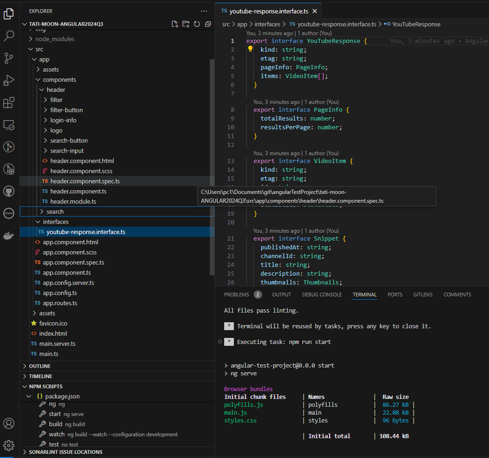
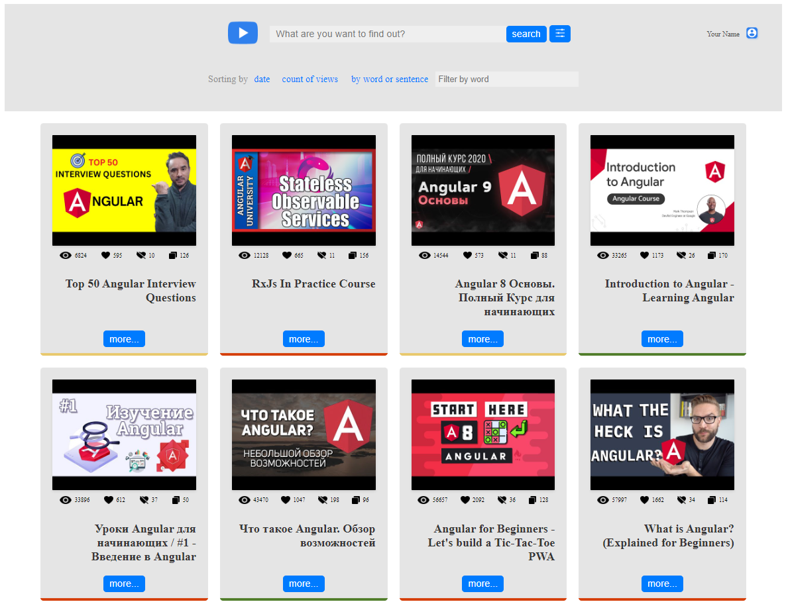
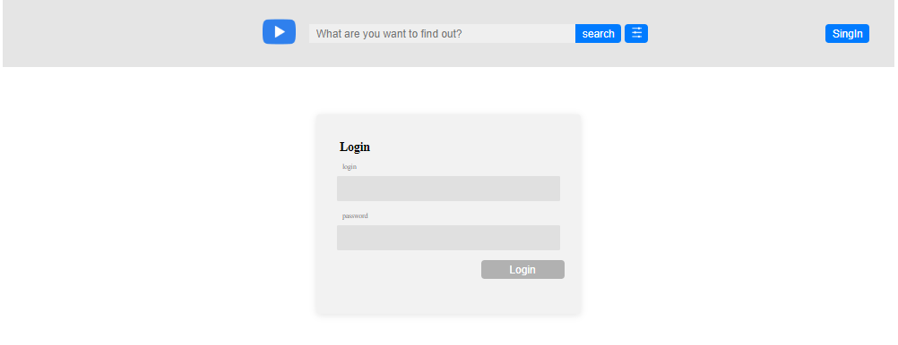
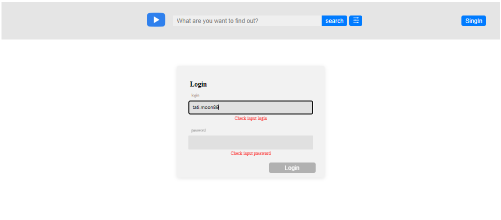
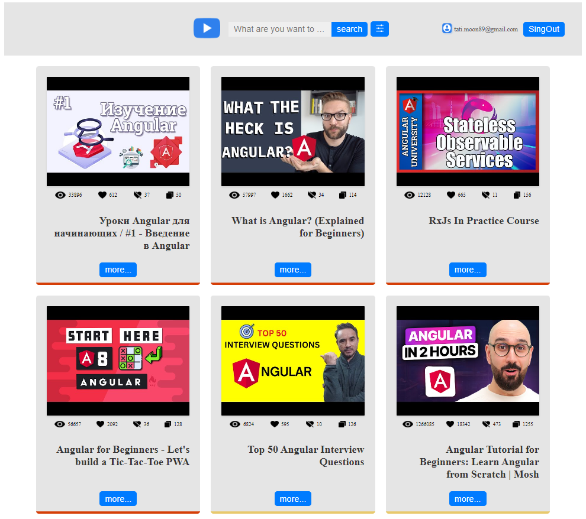
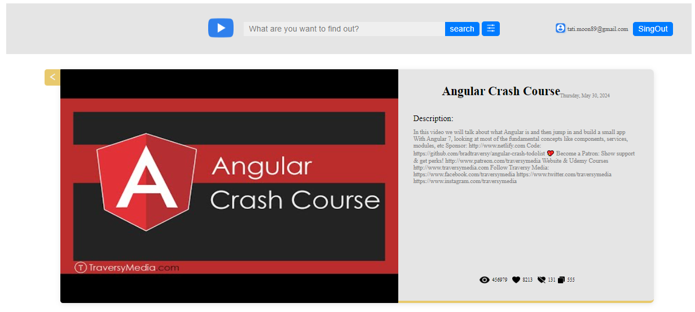
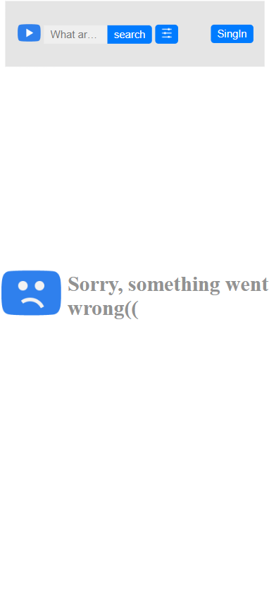

## Getting Started

To get started with this project:

1. Clone this repository.
2. Navigate to the project directory.
3. Install dependencies using `npm install`.

# Task 1: Angular. Intro task

1. Task: [link](https://github.com/rolling-scopes-school/tasks/blob/master/tasks/angular/intro.md)
2. Screenshot:

3. Score: 70 / 70

- [x] Generated a new Angular project using ng-cli `ng new`
- [x] Migrated Angular application to ESLint with rules AirBnB `npm i eslint-config-airbnb-base`: https://github.com/airbnb/javascript

1. `ng add @angular-eslint/schematics`
2. `npm i eslint-config-airbnb-typescript`
3. `npm i eslint-config-airbnb-base`
4. `npm i eslint-config-airbnb-typescript`
5. `npm i eslint-plugin-simple-import-sort`
6. Updated `.eslintrc.json`
7. Run `ng lint`

- [x] Generated all the necessary components using ng-cli.

```bash
ng generate module components/header
ng generate component components/header
ng generate component components/header/logo
ng generate component components/header/search-input
ng generate component components/header/search-button
ng generate component components/header/filter-button
ng generate component components/header/login-info

ng generate module components/header/filter
ng generate component components/header/filter
ng generate component components/header/filter/sort-buttons
ng generate component components/header/filter/word-filter-input

ng generate module components/search
ng generate component components/search
ng generate component components/search/search-item/
ng generate component components/search/search-results/
ng generate component components/search/search-item/video-thumbnail
ng generate component components/search/search-item/views-count
ng generate component components/search/search-item/likes-count
ng generate component components/search/search-item/dislikes-count
ng generate component components/search/search-item/comments-count
ng generate component components/search/search-item/more-button

ng generate class components/search/search-response.model --type=model
ng generate class components/search/search-item.model --type=model
```

- [x] Created necessary interfaces for YouTube client based on mocked JSON response stored in `.json` file
- [x] ESLint is configured for TypeScript, enabling the no-explicit-any rule.
- [x] TypeScript is configured with `strict: true` rule enabled.


# Task 2: Angular. Components. Directives & Pipes task

1. Task 2: [link](https://github.com/rolling-scopes-school/tasks/blob/master/tasks/angular/components-directives-pipes.md)
2. Screenshot:

3. Score: 100 /  100
- [x] Main layout is implemented (+10)
- [x] Fake search functionality is implemented: by submitting the form in the Header component, search results are shown (+20)
- [x] The Search result item component contains all the necessary data (+10)
- [x] The Filtering criteria block toggle functionality is implemented (+5)
- [x] The colored border under the Search result item is implemented using a Directive (+15)
- [x] Search result sorting is implemented (both ascending and descending directions) (+15)
- [x] Search result filtering by key words is implemented using a Pipe (+15)
- [x] Custom Button component is implemented and used across the application. The component utilizes [Content projection](https://angular.dev/guide/components/content-projection) to display the button text (+5)
- [x]  At least one of the components is implemented as [standalone](https://angular.dev/guide/components/importing). (+5)


# Task 3: Modules, Services, Routing Task

1. Task3: Modules & Services. Routing  [link](https://github.com/rolling-scopes-school/tasks/blob/master/tasks/angular/modules-services-routing.md/)
2. Screenshots:
index page:

login validation:

search page:

detail information:

404 page:


3. Score: 100 / 100
  - [x] The 404 page and redirection logic is implemented (+15)
  - [x] The Login page functionality with necessary rules is implemented (+30)
  - [x] The Detailed information page is implemented (+20)
  - [x] The app.component doesn't include any logic and used only for markup (+15)
  - [x] At least two services (Login service and Youtube service) are implemented (+20)
